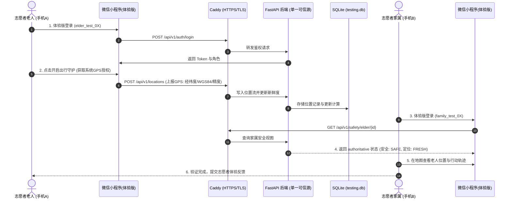

# 银龄安全系统（Silver Safe Platform）
# Phase 4 外部志愿者测试部署需求分析说明书

## 1. 文档基本信息

| 项目信息 | 内容 |
| :--- | :--- |
| **项目名称** | 银龄安全系统（Silver Safe Platform） |
| **当前阶段** | Phase 4：External Volunteer Test Readiness（外部志愿者测试准入准备） |
| **工程性质** | 阶段跃迁：从“本地单机/测试自动化”跃迁至“真实外部志愿者真机可用” |
| **文档目标** | 明确外部测试最小可行闭环（MVP）、P0 关键路径、环境安全与隔离验收标准 |

---

## 2. 阶段背景与核心矛盾

在前期工程中，系统已完成：
* FastAPI 权威后端业务逻辑与数据模型（94/94 单元与集成测试通过）；
* 微信小程序老人端、家属端与地图轨迹防漂移渲染（27/27 单元测试通过）；
* 本地单机环境下的隔离测试与种子数据初始化（`elder_test_01` / `family_test_01`）。

**当前核心矛盾**：
本地 `127.0.0.1:8000` 无法被外部志愿者真机微信访问；单套测试账号导致多名志愿者同时测试时地图轨迹“瞬移”和状态相互踩踏；缺少预置围栏导致家属端首次进入呈现“安全状态：暂无”。必须在不引入企业级过度架构（如 K8s、Kafka、分布式微服务）的前提下，构建**最低成本、最快就绪、绝对隔离的最小可行闭环**。

---

## 3. 核心业务闭环（MVP 目标）

测试环境必须完整支持以下端到端闭环验证，无阻塞性错误：

---

## 4. P0 优先级需求清单

本阶段坚决剔除企业级非必要需求（如分布式链路追踪、弹性伸缩、灰度发布），聚焦于阻断测试上线的 P0 级需求：

### 【P0-1】公网后端服务与 HTTPS 终止
* **需求描述**：提供公网可解析、可访问的独立后端服务入口。
* **验收条件**：
  1. 公网通过合法域名使用 TLS 1.2+ HTTPS 协议访问 `/docs` 或 `/health` 返回 200。
  2. 严禁使用 HTTP 明文协议或纯公网 IP 直连（微信平台会强行拦截）。
  3. Caddy/Nginx 自动完成 Let's Encrypt 证书签发与续期。

### 【P0-2】小程序环境地址配置动态适配
* **需求描述**：小程序的体验版（`trial`）与正式版环境配置必须指向正式公网 HTTPS 地址。
* **验收条件**：
  1. `miniprogram/config.js` 中的 `API_BASE_URL.testing` 从占位符 `https://test-domain/api/v1` 更改为公网真实 API 地址。
  2. 小程序运行时根据微信客户端环境（`wx.getAccountInfoSync().miniProgram.envVersion`）自动切换到公网 testing API。

### 【P0-3】微信公众平台合法域名准入
* **需求描述**：微信要求所有小程序外联网络必须在后台配置安全白名单。
* **验收条件**：
  1. 在微信公众平台【开发管理】->【开发设置】->【服务器域名】的 `request合法域名` 中配置该公网域名。
  2. 真机关闭“开发版不校验合法域名”开关后，网络请求依然 100% 成功。

### 【P0-4】多组测试账号独立隔离（10 组）
* **需求描述**：为避免多名志愿者同时测试时发生状态覆盖与轨迹跳变，测试环境必须预生成 10 组严格隔离的测试账号。
* **账号规范**：
  * 老人账号：`elder_test_01` 至 `elder_test_10`
  * 家属账号：`family_test_01` 至 `family_test_10`
  * 密码规范：统一由环境变量 `TEST_ACCOUNT_PASSWORD` 指定（或缺省安全测试密码）
* **隔离边界**：
  * 每对老人与家属建立 1:1 的 `ElderFamilyBinding`。
  * 家属 `family_test_01` 严禁查看 `elder_test_02` 的位置、行程或安全状态（后端 403 阻断）。
  * 每个老人拥有独立的 active 状态 Trip，避免出行冲突。

### 【P0-5】预置测试围栏（Geofence）与初始安全体验数据
* **需求描述**：家属端首次登录时，必须能感知到有意义的健康与风险状态，杜绝“安全状态：暂无”等未初始化体验。
* **设计要求**：
  * 为每个 `elder_test_0X` 自动注入一个默认启用的电子围栏（`Geofence`）。
  * 围栏中心点可设为城市标志性公园或测试区域（如经度 113.324520, 纬度 23.119990），半径统一设定为 500 米（或 1000 米）。
  * 预置有效出行行程（Trip 状态为 `active`），以便老人上报点位进入该区域后，后端实时裁决为 `SAFE` 且时效为 `FRESH`。

---

## 5. 环境隔离与测试可复现性需求

### 5.1 数据库物理隔离
* 生产/测试环境必须完全隔离于本地开发数据库。
* 开发环境数据库：`data/silver_safe.db`
* 志愿者测试数据库：`/var/lib/silver-safe/testing.db`（或独立路径 `data/silver_safe_testing.db`）
* 运行 testing 环境时，严禁写入开发数据库；运行重置命令时，严禁跨库误删。

### 5.2 数据库一键重置（Reset & Seed）
* 提供独立脚本 `scripts/reset_testing.py`：
  1. 仅允许在显式指定 `APP_ENV=testing` 时运行。
  2. 自动清理测试数据库中的历史轨迹、告警与行程。
  3. 重新初始化 10 组标准隔离账号、绑定关系、有效行程与预置围栏。
  4. 支持在两轮志愿者测试之间实现 10 秒快速重置。

---

## 6. 安全与合规非功能性需求

1. **后端单一权威原则（Backend Authority）**：
   * 所有安全风险判定、新鲜度计算、围栏进出越界逻辑必须 100% 封闭在后端。
   * 小程序仅负责通过 `wx.getLocation` 采集并上报 WGS84 原始坐标，严禁在小程序端编写计算风险的侵入逻辑。
2. **位置隐私与数据保护**：
   * 志愿者测试前必须弹窗或线下告知其位置采集仅供比赛测试。
   * 老人敏感健康信息必须遵循 `field_encryption` 进行加密存储。
   * 测试结束后，可通过重置脚本彻底物理销毁真实移动轨迹。

---

## 7. 准入验收标准清单（Go / No-Go Criteria）

在正式邀请外部志愿者扫码测试前，系统必须逐项验证并通过以下 8 项标准：

- [ ] **AC-1**：公网 HTTPS 访问通过真实移动蜂窝网络（4G/5G）测试，TLS 握手正常。
- [ ] **AC-2**：微信公众平台 `request` 合法域名配置生效，真机在未勾选“调试模式”下请求成功。
- [ ] **AC-3**：`elder_test_01` 与 `elder_test_02` 并发上报不同坐标，彼此轨迹独立，无串扰、无覆写。
- [ ] **AC-4**：`family_test_01` 无法通过接口越权获取 `elder_test_02` 的任何位置数据。
- [ ] **AC-5**：老人上报在围栏内的坐标后，家属端首页明确展示 `安全` 与 `定位正常`。
- [ ] **AC-6**：运行 `python scripts/reset_testing.py` 可在不重启服务的情况下将数据库重置至干净基线。
- [ ] **AC-7**：后端 94 项自动化测试与前端 27 项测试保持 100% 通过。
- [ ] **AC-8**：执行发布前检查脚本 `verify_testing_readiness.py` 判定全部通过（EXIT CODE = 0）。
